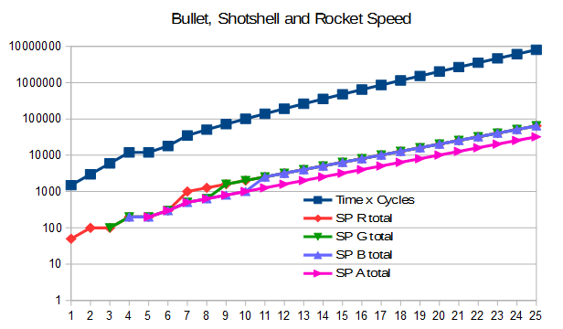

Late Upgrades -- A Mod for Factorio v0.13
========================================

This is a mod for a game called Factorio. It's compatible with Factorio v0.13
(NOT compatible with v0.12 or earlier).
This mod will add upgrade researches up to level 25 as resource sinks for late
game.

The resources required for each level increases exponentially, so it will be
harder and harder to finish researches as level goes up.

This mod is inspired by another mod, Leon's Automatic Upgrade Generation.
Actually the concept is the same. But the mod had multiple problems, so I
decided to write my own version. The problems I wanted to address are:

* The mod was not compatible with v0.13. Several entities have changed internal
names, so you can't just rewrite info.json to make it compatible.

* The mod altered existing (vanilla) research recipes, which makes introducing
the mod to an existing save causes issues. My version respects existing
recipes and do not touch them, which should make introducing into existing saves
'fair'.

* The mod blindly applied the same rule to multiple types of upgrades, but
impact of an upgrade depends on what kind of benefit the upgrade provides.
For example, Worker Robot Speed 1 increases the speed of robots by 35%,
but Worker Robot Cargo Size 1 doubles cargo size, which increases throughput
by 100%! My mod assigns different base of exponent to those upgrades to
address this problem.

* The codes in Leon's mod were so redundant and hard to maintain (by maintaining
I mean adapting to new Factorio version). For instance, using previous variables
in a loop iteration to determine next values is bad practice, because it's hard
to predict the outcome until you actually run the code. Using closed form
formula to compute the numbers is preferred method.

In order to keep vanilla research recipes intact, we need to somehow
'extrapolate' existing ingredient requirements to make the new recipes somewhat
continuous.

As you can see in an example plot below (note the logarithmic scale), resources
required by upgrades increase radically, so you (hopefully) won't need to worry
about reaching max level.

